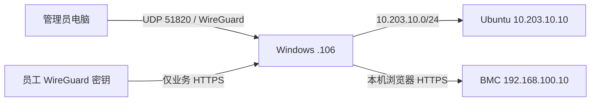
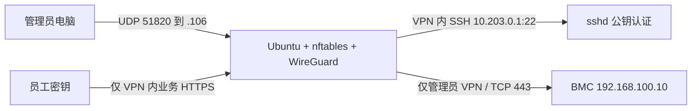

# CZ Safety：物理服务器边界安全部署

这是一个与 FRP/内网穿透完全独立的项目。它只包含两个部署入口：

1. `deploy-windows-bastion.ps1`：Windows 持有公网 `.106`，作为 WireGuard 边界网关和跳板。
2. `deploy-ubuntu-direct.sh`：Ubuntu 服务器直接持有公网 `.106`。

示例地址 `203.0.113.104/30` 属于文档网段，脚本会拒绝把它应用到真实设备。当前 IDC 分配的真实 `/30` 关系是 `.104` 网络地址、`.105` IDC 网关、`.106` 本方设备、`.107` 广播地址。脚本本身不硬编码这些末位，而是通用校验网关必须为 `/30` 第一可用地址、边界设备必须为第二可用地址。

## 先处理“已失陷”事实

SSH 密码被他人修改，说明应把旧系统视为已失陷。防火墙不能证明内核、启动项、用户密钥或应用没有后门。推荐现场先备份必要业务数据和取证材料，然后全新安装 Ubuntu Server 24.04 LTS、更新 BIOS/BMC/系统固件、修改 BMC 管理密码、轮换全部 SSH/API/数据库密钥，再运行本项目。若业务要求保留旧盘，应先离线镜像，不能直接把旧系统重新接回公网。

本项目能把主机边界收敛到 WireGuard，并降低扫描、爆破、横向访问和错误暴露风险；它不能消除占满 IDC 上联带宽的流量型 DDoS。没有上游清洗时，真正的大流量攻击仍需向 IDC、运营商或专用清洗服务购买上游防护。

## 两条链路

### A. Windows 边界网关/跳板

推荐硬件是 Windows 两个物理网口：WAN 口连接 IDC；LAN 口连接交换机，交换机再连接 Ubuntu 业务口和 BMC 管理口。LAN 口同时配置 `10.203.10.1/24` 与 `192.168.100.1/24`，因此不需要第三个 Windows 网口。



管理员先建立 WireGuard，随后可直接 SSH `10.203.10.10`，或通过 WireGuard RDP 到 Windows 再管理。BMC 默认不向 VPN 路由：管理员通过 WireGuard RDP 进入 Windows，然后在 Windows 浏览器访问 `https://192.168.100.10`。如果设备只支持 HTTP，把现场配置的 `webScheme` 改为 `http`；仍只能在隔离的 Windows 内网侧访问。这样即使员工篡改客户端路由，也没有为其开放 BMC 的防火墙规则。

Windows 公网入站只允许 WireGuard UDP 端口；RDP、SMB、WinRM 和 Ubuntu SSH 都不直接暴露在公网。Ubuntu 只接受管理员 VPN 地址段的 SSH、管理员/员工各自允许的 HTTPS。部署阶段临时允许 Windows 私网地址 SSH，`Confirm -ConfirmExternal` 会在真实外部测试成功后删除该临时规则。

### B. Ubuntu 直接接公网

Ubuntu 的 WAN 口持有 `.106/30`，第二个物理口连接 BMC 管理口或其管理交换机，第二口使用 `192.168.100.1/24`。若现场没有第二个可用物理口，保持 `BMC_MODE=auto` 并清空 `BMC_INTERFACE`，脚本会安全地禁用 BMC 路由，不能把 BMC 接到公网口。



公网 TCP/22 会被 nftables 丢弃，所以不能再直接执行 `ssh 公网IP`。正确顺序是先在管理员电脑启用 WireGuard，获得管理员地址（例如 `10.203.0.2`），再执行：

```bash
ssh safetyops@10.203.0.1
```

WireGuard 不是 SSH 的替代品。它先完成设备密钥认证和加密隧道，SSH 再在隧道内部完成用户公钥认证，形成两层独立控制。每个人应使用独立 WireGuard peer；人员离职或密钥丢失时执行 `peer-revoke`，不要多人共享配置文件。

## 权限模型

| 访问者 | WireGuard | SSH Ubuntu | 业务 HTTPS | BMC |
|---|---:|---:|---:|---:|
| 未建立 VPN | 仅可尝试 UDP 51820 | 拒绝 | 拒绝 | 拒绝 |
| Employee peer | 是 | 拒绝 | 允许 | 拒绝 |
| Admin peer | 是 | 公钥认证允许 | 允许 | Ubuntu 直连时可路由；Windows 时先 RDP 再本地浏览 |

服务端按 peer 的 `/32` 地址归类，客户端 `AllowedIPs` 只负责路由便利，不能当作授权边界。真正的授权由服务端 nftables/Windows Firewall 和 Ubuntu nftables共同执行。

Ubuntu 直连的出站模式默认使用 `strict`：UDP 只开放 DNS/53 和 NTP/123，更新流量使用 TCP/80/443，因此不会默认放行 QUIC。`staged` 额外开放 UDP/443，供明确需要 HTTP/3/QUIC 的应用发现依赖；`audit` 暂时允许全部出站，仅用于现场记录依赖后再收紧。

`preflight` 始终把结构化结果写到标准输出：状态为 `PASS` 或 `PENDING_UBUNTU_SITE` 时退出码为 0，状态为 `BLOCKED` 时退出码为 2，配置或执行错误为 1。CI 和编排脚本必须先捕获 JSON，再按 `status` 判定；不能把非零退出码一律解释成脚本崩溃。`Evidence` 会容忍 preflight 的退出码 2 并把该 JSON 收进证据包。

离线契约套件共 10 项。未安装 `pwsh` 的 Linux 主机会执行 9 项并明确跳过 1 项 Windows 测试，这种结果不能写成“10/10”；只有通过 `PWSH=/path/to/pwsh` 提供真实 PowerShell 并看到 10 项全部通过时，才能声明“10/10 passed”。Linux 侧还应单独记录 Ubuntu 版本，以及在具备 `CAP_NET_ADMIN` 时真实 `nft -c -f` 的结果。

## 现场共同前置条件

- 现场必须有显示器/键盘或可用的本地控制台；BMC 尚未安全接入前不能把它当作唯一回滚渠道。
- 记录物理网口 MAC、交换机端口、WAN/LAN/BMC 接线；先拔掉公网线完成系统恢复。
- 使用干净介质重装或确认可信基线，启用 Secure Boot（硬件支持时），更新固件和 Ubuntu。
- 准备每位管理员的 SSH 公钥和单独的 WireGuard 配置传输介质。
- Windows 方案需 Windows 11/Windows Server 的管理员 PowerShell、WireGuard for Windows、`ssh.exe`，并先在 Ubuntu 控制台准备 `safety-bootstrap` 用户、公钥和免交互 `sudo`。
- 在 Ubuntu 控制台记录 `ssh-keygen -lf /etc/ssh/ssh_host_ed25519_key.pub` 的指纹；Windows 用 `ssh-keyscan -t ed25519 10.203.10.10` 生成配置指定的 `known_hosts` 后必须人工比对该指纹。脚本使用 `StrictHostKeyChecking=yes`，不会自动信任未知主机。
- 先复制示例配置为未跟踪的现场配置，修改真实公网地址、接口名和用户。绝不把真实私钥或现场配置提交到仓库。

## 客户端和 USB 材料准备

在管理员自己的可信电脑运行与系统对应的脚本，输出目录必须是一个尚不存在的新目录：

```bash
# Ubuntu
./prepare-client-ubuntu.sh "$HOME/CZ-Safety-USB"

# macOS；默认目录同样位于 HOME，不使用可能被 iCloud 同步的 Desktop
./prepare-client-macos.sh "$HOME/CZ-Safety-USB"
```

```powershell
.\prepare-client-windows.ps1 -OutputDir "$env:USERPROFILE\CZ-Safety-USB"
```

脚本不会覆盖或递归删除现有目录。管理员私钥只生成或复用于本机 `~/.ssh/admin_ed25519`（Windows 为 `%USERPROFILE%\.ssh\admin_ed25519`），绝不会写入 USB 输出树；USB 中仅包含 `admin_authorized_keys` 公钥副本。三个脚本都从 `usb-readme.template.txt` 生成相同的现场说明，避免平台版本漂移。

Windows 上找不到 Python 时，脚本仍会复制合法的 `site.windows.json` 模板，但不会自动补充 `_comment` 中的管理员公钥和 bootstrap 路径提示，并会输出明确告警；现场需要手动核对这些字段。Windows 脚本使用空字符串参数生成密钥，随后立即执行 `ssh-keygen -y -P '' -f KEY` 验证目标 OpenSSH 确实能以空口令加载；验证失败会终止，不允许继续生成现场包。Bootstrap 私钥仍属于敏感临时凭据，只能使用加密移动介质，部署确认后应从 Windows 和介质清除。

## Ubuntu 直连部署顺序

在干净的 Ubuntu Server 24.04 控制台执行：

```bash
cd apps/safety
cp site.ubuntu.conf.example site.ubuntu.conf
# 修改 site.ubuntu.conf；把 PACKAGE_MODE 改为 online，或事先离线安装依赖。
sudo install -d -m 0700 /root/cz-safety
sudo install -m 0600 /安全介质/admin_authorized_keys /root/cz-safety/admin_authorized_keys
sudo ./deploy-ubuntu-direct.sh preflight --config site.ubuntu.conf
sudo ./deploy-ubuntu-direct.sh plan --config site.ubuntu.conf | less
sudo ./deploy-ubuntu-direct.sh apply --config site.ubuntu.conf --confirm-console
sudo /usr/local/sbin/deploy-ubuntu-direct.sh peer-add --config /etc/cz-safety/site.conf --name onsite-admin --role admin
```

把 `/var/lib/cz-safety/exports/onsite-admin.conf` 通过安全介质导入现场另一台电脑。从非服务器控制台的网络测试 WireGuard、SSH、员工拒绝和 BMC 后，在 20 分钟自动回滚窗口内执行：

```bash
sudo /usr/local/sbin/deploy-ubuntu-direct.sh verify --config /etc/cz-safety/site.conf
sudo /usr/local/sbin/deploy-ubuntu-direct.sh confirm --config /etc/cz-safety/site.conf --confirm-external
sudo /usr/local/sbin/deploy-ubuntu-direct.sh evidence --config /etc/cz-safety/site.conf
```

若现场没有可靠互联网，应提前在一台全新的、同架构 Ubuntu 24.04 机器上以 root 运行 `prepare-bundle --output-dir offline-debs`，把生成的 `.deb` 与 `SHA256SUMS` 一起带到现场，并把 `PACKAGE_MODE` 设为 `offline`。这里保留 root 要求，是因为该动作会先执行 `apt-get update`，再使用 apt 的系统包状态计算依赖闭包；不要在已安装这些包的日常主机上生成依赖包，否则 apt 可能不会重新下载所有依赖。

## Windows 跳板部署顺序

先在不连接公网的 Windows 管理员 PowerShell 中执行：

> [!WARNING]
> Windows `Apply` 面向专用边界跳板机。它会先导出完整 Windows Firewall 备份，然后禁用所有不属于 `CZ-Safety` 组的已启用入站 Allow 规则，作用于 Domain、Private、Public 三类 profile。部署前必须盘点现有业务规则并准备本地控制台；不要在承载其他业务的共享 Windows 主机上直接执行。

```powershell
Set-Location apps\safety
Copy-Item site.windows.json.example site.windows.json
# 修改真实地址、网卡别名、bootstrap key 与已核验 known_hosts 路径。
.\deploy-windows-bastion.ps1 -Action Preflight -Config .\site.windows.json
.\deploy-windows-bastion.ps1 -Action Plan -Config .\site.windows.json
.\deploy-windows-bastion.ps1 -Action Apply -Config .\site.windows.json -ConfirmConsole
.\deploy-windows-bastion.ps1 -Action PeerAdd -Config .\site.windows.json -PeerName onsite-admin -Role Admin
```

WireGuard for Windows 的 peer 配置变更通过卸载并重新安装 tunnel service 生效；每次 `PeerAdd` 或 `PeerRevoke` 都会输出告警，并让所有现有 peer 短暂断连。应在维护窗口批量完成 peer 变更，避免在正在进行的 SSH/RDP 会话中执行。

导入 `C:\ProgramData\CZ-Safety\exports\onsite-admin.conf`，从另一台电脑完成真实外部测试后再确认：

```powershell
.\deploy-windows-bastion.ps1 -Action Verify -Config .\site.windows.json
.\deploy-windows-bastion.ps1 -Action Confirm -Config .\site.windows.json -ConfirmExternal
.\deploy-windows-bastion.ps1 -Action Evidence -Config .\site.windows.json
```

Windows 的 `PrepareBundle` 会复制脚本、配置和配置中可选的 `wireguardInstallerPath`，并生成 SHA-256 清单；它不会静默从互联网下载或安装 WireGuard。安装包必须提前从 WireGuard 官方来源取得并在现场人工核对签名。

如失败，不要确认。等待定时任务自动回滚，或从本地控制台执行 `Rollback`。任何自动网络修改都要求 `--confirm-console`/`-ConfirmConsole`，示例 TEST-NET 地址也绝不会被 `Apply`。

回滚恢复的是本项目管理的网络、防火墙、WireGuard 和 SSH 配置。为避免删除唯一救援入口，它不会自动卸载已安装的软件包，也不会删除新建的 `safetyops`/`safety-bootstrap` 账户；现场验收后应按变更单决定保留或人工清理这些身份。

## 当前状态与验收

服务器关机时，本项目的最高可信状态是 `READY_FOR_SITE`：脚本可解析、示例配置有效、危险地址会被拒绝、渲染策略满足约束、没有仓库内私钥，并已生成带哈希的部署包。它不代表真实公网、Windows/Ubuntu 网卡、WireGuard 握手、SSH、BMC 或重启持久化已经通过。

现场必须完成的项目统一标记为 `PENDING_SITE`。完整判定表和命令见 [ACCEPTANCE.md](ACCEPTANCE.md)。
